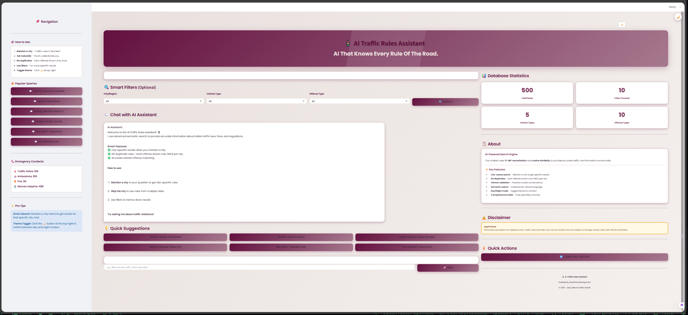
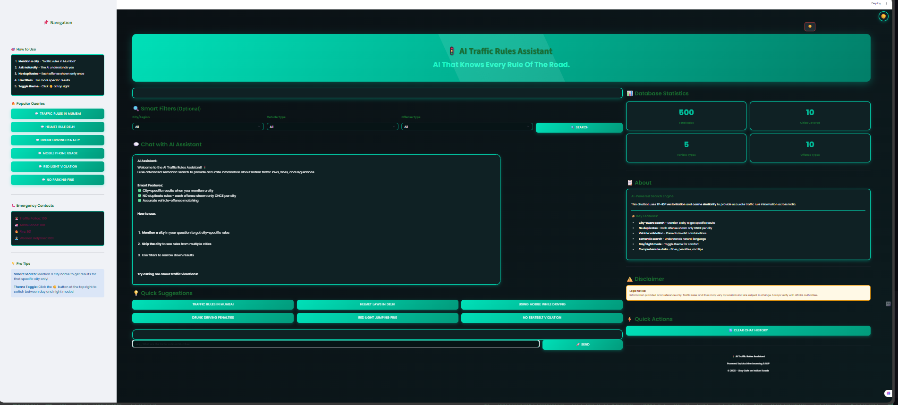

<div align="center">

# 🚦 AI Traffic Rules Assistant

### *AI That Knows Every Rule Of The Road.*

[](https://aitrafficrulechatbot.streamlit.app/)
[](https://www.python.org/downloads/)
[](https://github.com/yourusername/ai-traffic-rules-assistant/graphs/commit-activity)

[Live Demo](https://aitrafficrulechatbot.streamlit.app/) • • 

</div>

---

## 📋 Table of Contents

- [About The Project](#-about-the-project)
- [Key Features](#-key-features)
- [Screenshots](#-screenshots)
- [Tech Stack](#-tech-stack)
- [Getting Started](#-getting-started)
  - [Prerequisites](#prerequisites)
  - [Installation](#installation)
- [Project Structure](#-project-structure)
- [How It Works](#-how-it-works)
- [Database Statistics](#-database-statistics)
- [Usage Guide](#-usage-guide)
- [Contributing](#-contributing)
- [License](#-license)
- [Contact](#-contact)
- [Acknowledgments](#-acknowledgments)

---

## 🎯 About The Project

**AI Traffic Rules Assistant** is an intelligent, semantic search-powered application designed to provide instant access to comprehensive Indian traffic rules, regulations, and penalties. Built with advanced Natural Language Processing (NLP) techniques, the system uses **TF-IDF vectorization** and **cosine similarity** to deliver highly accurate, context-aware results.

### Why This Project?

- 🔍 Smart Search  
- 🏙️ City-Specific  
- 🚗 Vehicle-Aware  
- 🎨 User-Friendly Day/Night Mode  
- ⚡ Fast & Accurate  
- 📱 Fully Responsive  

---

## ✨ Key Features

| Feature | Description |
|--------|-------------|
| 🔎 Smart Semantic Search | TF-IDF + Cosine Similarity |
| 🏙️ City-Specific Results | Location-based rule lookup |
| 🚙 Vehicle Type Filtering | Car, Bike, Heavy Vehicle, etc. |
| 🚫 No Duplicate Rules | OMCE per city logic |
| 🎭 Day/Night Theme | One-click theme toggle |
| 📊 Offense Classification | Categorized rule browsing |
| 📞 Emergency Contacts | Quick access to authorities |
| 💡 Quick Suggestions | Common queries ready |
| 📈 Database Statistics | Real-time data summary |
| ⚡ High Performance | Optimized search engine |

---

## 🖼️ Screenshots

### Day Mode


### Night Mode


---

## 🛠️ Tech Stack

- Python  
- Streamlit  
- Pandas  
- NumPy  
- Scikit-learn  
- OpenPyXL  

---

## 🚀 Getting Started

### Prerequisites

```bash
python --version
```

### Installation

```bash
git clone https://github.com/tanish152/ai-traffic-rules-assistant.git
cd ai-traffic-rules-assistant
```

### Create virtual environment

```bash
python -m venv venv
```

### Install dependencies

```bash
pip install -r requirements.txt
```

### Run the App

```bash
streamlit run app.py
```

---

## 📁 Project Structure

```
ai-traffic-rules-assistant/
│── app.py
│── requirements.txt
│── README.md
│
├── data/
│   ├── traffic_rules.xlsx
│   
│
├── assets/
│   ├── day-mode.png
│   ├── night-mode.png
│   └── logo.png
│
├── utils/
│   ├── search_engine.py
│   ├── data_processor.py
│   └── filters.py
│
└── .streamlit/config.toml
```

---

## 🧠 How It Works

### Core Logic

- **TF-IDF Vectorizer**
- **Cosine Similarity**
- **City-based Filtering**
- **Vehicle-based Filtering**
- **Duplicate Rule Removal**

---

## 📊 Database Statistics

| Metric | Count |
|--------|-------|
| Total Rules | 500 |
| Cities Covered | 10 |
| Vehicle Types | 5 |
| Offense Types | 10 |

---

## 📖 Usage Guide

- Natural language search  
- Apply city filter  
- Apply vehicle filter  
- Use Quick Suggestions  
- Toggle Day/Night Mode  

---

## 🤝 Contributing

Steps:

1. Fork  
2. Create Feature Branch  
3. Commit  
4. Push  
5. Submit PR  

---

## 📄 License

GNU Affero General Public License v3.0

---

## 📞 Contact

**Maintainer:** Tanish Khokha Samridhi Gupta
Project Link: https://github.com/tanish152/ai-traffic-rules-assistant  
Live Demo: https://aitrafficrulechatbot.streamlit.app/

---

## 🙏 Acknowledgments

- Streamlit  
- Scikit-learn  
- MORTH  
- Contributors  

</div>
